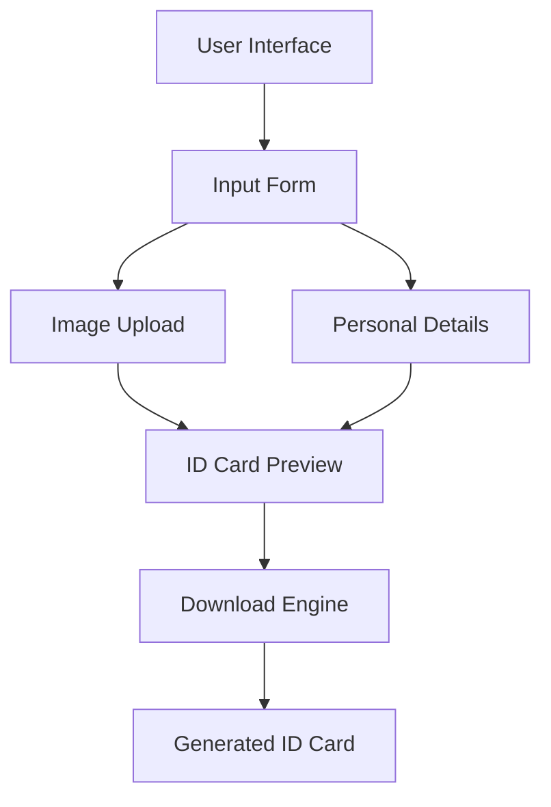
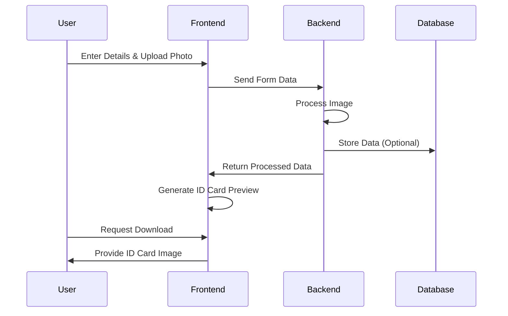

# 🪪 ID-Card-Generator 🪪

[](https://nodejs.org/)
[](https://expressjs.com/)
[](https://developer.mozilla.org/en-US/docs/Web/HTML)
[](https://developer.mozilla.org/en-US/docs/Web/CSS)
[](https://developer.mozilla.org/en-US/docs/Web/JavaScript)


## 📋 Project Description

The ID Card Generator is a web application that allows users to create and download personalized ID cards. The application provides a user-friendly interface to input personal details and generate a professional-looking ID card.

## 🎯 Purpose

The purpose of this project is to provide a simple and efficient way to generate ID cards for various purposes such as visitor badges, employee IDs, and event passes.

## ✨ Functionality

| Feature | Description |
|---------|-------------|
| 📸 **Profile Picture** | Upload a personal photo to be displayed on the ID card |
| 📝 **Personal Details** | Input name, mobile number, date of birth, address, and validity date |
| 👁️ **Preview** | See how the ID card will look before downloading |
| 💾 **Download** | Save the generated ID card as an image file |

## 🔍 Problem Statement

Creating ID cards manually can be time-consuming and prone to errors. This project aims to automate the process of generating ID cards, making it quick and error-free.

## 💡 Benefits

> 🕒 **Time-Saving**: Significantly reduces the time needed to create professional ID cards

> 🎯 **Consistency**: Ensures all ID cards follow the same format and quality standards

> 🏆 **Professional Appearance**: Delivers polished, well-designed ID cards every time

## 🛠️ Technical Architecture



## 💻 Techstack

| Technology | Purpose | Component |
|------------|---------|-----------|
| 🖥️ **HTML** | Structure | Frontend |
| 🎨 **CSS** | Styling | Frontend |
| ⚙️ **JavaScript** | Interactivity | Frontend |
| 🚀 **Node.js** | Runtime Environment | Backend |
| 🔄 **Express** | Web Framework | Backend |
| 📁 **Multer** | File Handling | Backend |
| 🖼️ **html2canvas** | Image Generation | Frontend |
| 🗄️ **MongoDB** | Data Storage (Optional) | Backend |

## 📥 Installation

1. Clone the repository:
   ```bash
   git clone https://github.com/Yash-Kavaiya/ID-Card-Generator.git
   ```
2. Navigate to the project directory:
   ```bash
   cd ID-Card-Generator
   ```
3. Install the dependencies:
   ```bash
   npm install
   ```

## 🚀 Usage

1. Start the server:
   ```bash
   npm start
   ```
2. Open your browser and navigate to `http://localhost:5000`
3. Fill in the required details and upload a profile picture
4. Click on "Generate ID Card" to preview the ID card
5. Click on "Download ID Card" to save the ID card as an image

## 📦 Dependencies

| Package | Version | Purpose |
|---------|---------|---------|
| body-parser | ^1.20.3 | Parse HTTP request bodies |
| express | ^4.21.1 | Web application framework |
| html2canvas | ^1.4.1 | Convert HTML to canvas for download |
| mongoose | ^8.7.3 | MongoDB object modeling |
| multer | ^1.4.5-lts.1 | Handle multipart/form-data for uploads |

## 📂 File Structure

```
ID-Card-Generator/
├── client/
│   ├── index.html    # Main HTML file
│   └── style.css     # CSS styling
├── server/
│   └── app.js        # Express server logic
├── package.json      # Project metadata
└── README.md         # Documentation
```

## 📊 Process Flow



## 📷 Screenshot


---

<div align="center">
  <p>🪪 <b>ID Card Generator</b> - Create professional ID cards in seconds! 🚀</p>
</div>
